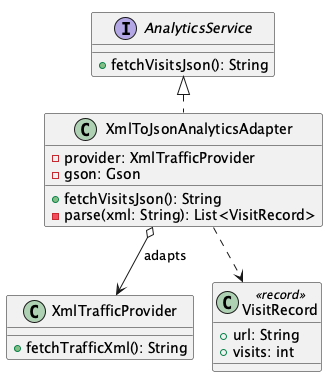

# XML-to-JSON Analytics

**Pattern:** [Adapter](../README.md)

## 📖 The Story (the problem)
Our whole analytics dashboard is built around **JSON**. Every data source is expected to implement
one small interface, `AnalyticsService`, and hand back its metrics as a JSON array.

Then the company acquires an older product, and we need its page-traffic data. The catch: that
legacy system is a **third-party black box** that only exposes its data as **XML**, and we cannot
change its code.

Forcing the dashboard to deal with this directly is ugly:

* The dashboard would have to learn how to parse XML, just for this one source.
* That XML-parsing logic would leak into code that should only ever see clean JSON.
* If we later swap the legacy system out, we'd be untangling its quirks from our core code.

## 💡 The Solution (using the Adapter pattern)
Put a small **adapter** between the two. It implements the interface our app wants and quietly
translates to the interface the legacy system offers.

* **`AnalyticsService`** — the *target* interface the dashboard depends on (`fetchVisitsJson()`).
* **`XmlTrafficProvider`** — the *adaptee*: the third-party system we can't change, which only
  speaks XML (`fetchTrafficXml()`).
* **`XmlToJsonAnalyticsAdapter`** — the *adapter*. It implements `AnalyticsService`, calls the
  provider, parses the XML, and serialises the result to JSON. The dashboard never sees the XML.

## 💻 In Code
```java
// The legacy system only emits XML...
XmlTrafficProvider legacy = new XmlTrafficProvider();

// ...but wrapped in the adapter it looks just like any other AnalyticsService.
AnalyticsService analytics = new XmlToJsonAnalyticsAdapter(legacy);

// The dashboard speaks only JSON and never knows XML was involved.
String json = analytics.fetchVisitsJson();
// [{"url":"/home","visits":1200},{"url":"/blog","visits":875},{"url":"/pricing","visits":340}]
```

## 🛠️ UML Diagram



## 🎯 What We Gain
* **Incompatible code works together:** a JSON-based app consumes an XML-only system unchanged.
* **Isolation:** all the XML knowledge lives in one class; the rest of the app stays JSON-only.
* **Swappable:** replace the legacy system and you only rewrite the adapter, nothing else.
* **Single Responsibility:** translation is separated from the business logic that uses the data.

## ⚠️ Watch Out For
* **It's a translator, not a fixer.** An adapter should bridge interfaces, not hide real bugs or
  silently drop data during conversion.
* **Conversion has a cost.** Parsing and re-serialising on every call can add up; cache results if
  the source is slow (that's where the [Proxy](../../proxy/README.md) pattern can help).
* **Two-way needs two adapters.** This one only adapts XML→JSON; going the other way is a separate
  responsibility.
