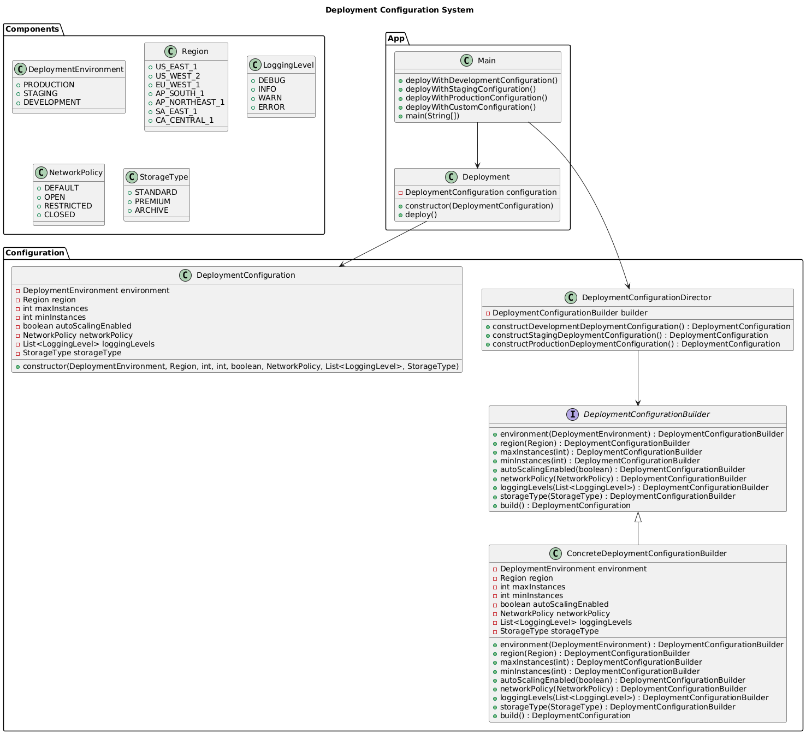

# Deployment Configuration System

**Pattern:** [Builder](../README.md)

## 📖 The Story (the problem)
Configuring deployments for different environments — Development, Staging, Production — needs different sets of parameters: region, scaling options, network policy, storage type, logging levels, and more.

The challenge is:

* How do we build environment-specific configurations without duplicating code?
* How do we reuse the same assembly logic as new environments appear?
* How do we avoid a giant constructor with a dozen arguments?

## 💡 The Solution (using the Builder pattern)
The Builder pattern assembles a complex object step by step, separating *how* it is built from *what* it ends up being.

* **`DeploymentConfiguration`** — the product; an immutable object holding all the settings.
* **`DeploymentConfigurationBuilder`** — the builder interface; one method per setting, each returning the builder so calls can chain.
* **`ConcreteDeploymentConfigurationBuilder`** — the concrete builder; it validates each value and assembles the product in `build()`.
* **`DeploymentConfigurationDirector`** — the director; it holds ready-made recipes (`constructDevelopmentDeploymentConfiguration()`, `...Staging...`, `...Production...`) so a caller can get a correct configuration without knowing the individual steps.

## 💻 In Code
Use the director's ready-made recipe:

```java
DeploymentConfigurationBuilder builder = new ConcreteDeploymentConfigurationBuilder();
DeploymentConfigurationDirector director = new DeploymentConfigurationDirector(builder);

DeploymentConfiguration config = director.constructProductionDeploymentConfiguration();
new Deployment(config).deploy();
```

Or assemble a custom configuration directly with the fluent builder:

```java
DeploymentConfiguration config = new ConcreteDeploymentConfigurationBuilder()
        .environment(DeploymentEnvironment.PRODUCTION)
        .region(Region.US_WEST_2)
        .maxInstances(10)
        .minInstances(5)
        .autoScalingEnabled(true)
        .build();
```

## 🛠️ UML Diagram



## 🎯 What We Gain
* **Single Responsibility:** the builder assembles and validates; the director holds the per-environment recipes.
* **Open/Closed:** add a new environment by adding a new recipe — the product and builder stay untouched.
* **Reusability:** the same builder and assembly steps are reused for every environment.
* **Safety:** required fields and value ranges are checked in `build()`, and the product is immutable once built.

## ⚠️ Watch Out For
* **More moving parts:** builder + director + product is overkill for simple objects with few fields.
* **Two-phase object:** the builder is mutable while assembling; `build()` produces the finished, immutable config.
* **Late validation:** a missing required field is only reported when `build()` runs.
