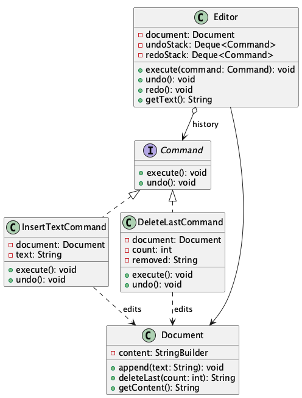

# Text Editor Undo / Redo

**Pattern:** [Command](../README.md)

## 📖 The Story (the problem)
Every text editor needs **undo** and **redo**. The naive way is to let the editor change the text
directly — `document.append(...)`, `document.delete(...)` — straight from the keyboard handler.

That quickly falls apart:

* To undo, the editor would have to *guess* how to reverse each change. How many characters did the
  last keystroke add? What exactly did that delete remove?
* The editor ends up with a giant `if/else` over every kind of edit, and it has to remember the
  details of each one to reverse it.
* Adding a new kind of edit (paste, replace, auto-format) means touching that growing switch again.

## 💡 The Solution (using the Command pattern)
Wrap each edit in a small **command object** that knows how to both *do* and *undo* itself. The
editor stops editing the text directly and instead runs commands and keeps a history.

* **`Command`** — the interface with `execute()` and `undo()`. Every edit is one of these.
* **`InsertTextCommand` / `DeleteLastCommand`** — concrete commands. Each holds the data it needs
  (the text to insert, or the number of characters to delete) and knows how to reverse itself.
  `DeleteLastCommand` even remembers the text it removed so it can paste it back.
* **`Document`** — the *receiver*. It actually changes the text but knows nothing about undo/redo.
* **`Editor`** — the *invoker*. It runs commands and keeps two stacks: one for undo, one for redo.
  It never knows what a command does — it only calls `execute()` and `undo()`.

## 💻 In Code
```java
Document document = new Document();
Editor editor = new Editor(document);

editor.execute(new InsertTextCommand(document, "Hello"));
editor.execute(new InsertTextCommand(document, ", World"));  // "Hello, World"
editor.execute(new DeleteLastCommand(document, 6));          // "Hello,"

editor.undo();   // " World" comes back -> "Hello, World"
editor.undo();   // undo the ", World" insert -> "Hello"
editor.redo();   // redo that insert    -> "Hello, World"
```

## 🛠️ UML Diagram



## 🎯 What We Gain
* **Unlimited undo/redo:** because each command can reverse itself, the editor just walks its history.
* **Decoupling:** the invoker (`Editor`) is fully separated from the receiver (`Document`).
* **Open/Closed:** new edits (paste, replace) are new `Command` classes — the editor never changes.
* **Composable history:** commands are plain objects, so they can also be queued, logged, or replayed.

## ⚠️ Watch Out For
* **Undo must be exact.** A command has to capture whatever it needs to reverse itself (here,
  `DeleteLastCommand` stores the removed text). Forget that and undo silently corrupts the document.
* **A class per action.** The pattern trades a few extra classes for the undo/redo power — overkill
  if you never need to reverse anything.
* **New commands clear redo.** Just like real editors, running a fresh command abandons the redo
  history; make sure that is the behaviour you want.
