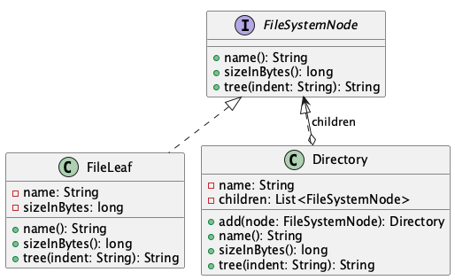

# File System Tree

**Pattern:** [Composite](../README.md)

## 📖 The Story (the problem)
A file system is a tree: a folder contains files **and** other folders, which contain more files and
folders, all the way down. Now you want to answer a simple question — "how big is this folder?" — or
print the whole tree.

If your code has to constantly ask *"is this a file or a folder?"*, it gets ugly fast:

* Every operation grows an `if (node instanceof File) ... else if (node instanceof Folder) ...`
  branch, repeated everywhere.
* Computing a folder's size means manually recursing and special-casing each type.
* Add a new kind of node (a symlink, a shortcut) and you must hunt down every one of those branches.

## 💡 The Solution (using the Composite pattern)
Give individual objects (files) and groups of objects (directories) the **same interface**, so
client code can treat them uniformly and let the tree recurse on itself.

* **`FileSystemNode`** — the *component*: the shared interface (`sizeInBytes()`, `tree()`) that both
  files and directories implement.
* **`FileLeaf`** — the *leaf*: a single file with no children; its size is just its own size.
* **`Directory`** — the *composite*: holds a list of `FileSystemNode` children. Its `sizeInBytes()`
  simply sums its children, and its `tree()` renders them — recursing naturally because each child
  is itself a `FileSystemNode`, file or folder alike.

## 💻 In Code
```java
Directory root = new Directory("home")
        .add(new FileLeaf("notes.txt", 60))
        .add(new Directory("documents")
                .add(new FileLeaf("resume.pdf", 240))
                .add(new Directory("photos")
                        .add(new FileLeaf("trip.jpg", 1800))));

// One call works whether the node is a file or a whole sub-tree:
System.out.println(root.sizeInBytes());  // 2100  (60 + 240 + 1800)
System.out.print(root.tree(""));
```

## 🛠️ UML Diagram



## 🎯 What We Gain
* **Uniform treatment:** client code calls the same methods on a file and a directory — no type
  checks.
* **Natural recursion:** a composite operation (size, print) just delegates to its children, which
  may be composites themselves.
* **Open/Closed:** add a new node type by implementing `FileSystemNode`; existing code is untouched.
* **Whole-and-part symmetry:** a single file and a deep tree are interchangeable wherever a
  `FileSystemNode` is expected.

## ⚠️ Watch Out For
* **Leaky leaves:** a leaf has no children, so child operations (`add`) don't apply to it. Decide
  whether to expose them only on the composite (done here) or make them safe no-ops on the leaf.
* **Deep trees, deep recursion:** very deep structures can risk a stack overflow; switch to an
  explicit stack if you expect pathological depth.
* **Shared children:** if the same node is added under two parents, a change shows up in both —
  usually surprising. Keep the tree strictly hierarchical unless you mean otherwise.
