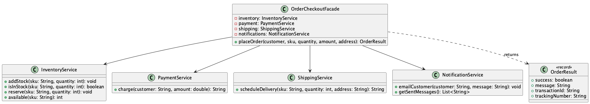

# Order Checkout

**Pattern:** [Facade](../README.md)

## 📖 The Story (the problem)
"Place an order" sounds like one action, but behind the scenes it's really four:

1. Check the warehouse has enough stock and reserve it.
2. Charge the customer's card.
3. Book a courier and get a tracking number.
4. Email the customer a confirmation.

If every caller (the web checkout, the mobile app, the admin tool) has to call all four subsystems
itself, in the right order, with the right error handling, you get problems:

* The same multi-step sequence is **copy-pasted** everywhere and easily gets out of order.
* Callers are **tightly coupled** to four classes they shouldn't need to know about.
* Change the flow (add fraud checks, loyalty points) and you must edit **every** caller.

## 💡 The Solution (using the Facade pattern)
Provide one **facade** that knows the whole sequence, and let callers make a single, simple call.

* **Subsystems** — `InventoryService`, `PaymentService`, `ShippingService`,
  `NotificationService`. Each does its own job and remains usable on its own.
* **`OrderCheckoutFacade`** — the facade. Its `placeOrder(...)` runs the four steps in order,
  short-circuits cleanly when an item is out of stock, and returns a tidy `OrderResult`.
* **`OrderResult`** — the small, friendly outcome the caller gets back (success/failure plus the
  payment and tracking references) — none of the subsystem detail leaks out.

## 💻 In Code
```java
OrderCheckoutFacade checkout =
        new OrderCheckoutFacade(inventory, payment, shipping, notifications);

// One call hides the stock-check, payment, shipping and email steps:
OrderResult result = checkout.placeOrder(
        "ada@example.com", "BOOK-GOF-1994", 2, 89.97, "10 Downing St");

System.out.println(result.success());        // true
System.out.println(result.trackingNumber()); // TRK-...
```

## 🛠️ UML Diagram



## 🎯 What We Gain
* **A simple entry point:** callers do one thing instead of orchestrating four.
* **Loose coupling:** client code depends on the facade, not on every subsystem.
* **One place to change the flow:** add fraud checks or loyalty points in the facade alone.
* **Subsystems stay independent:** they're still usable directly when you need fine-grained control.

## ⚠️ Watch Out For
* **Don't let it become a god object.** A facade should *delegate*, not absorb all the business
  logic of the subsystems it fronts.
* **It's a convenience, not a cage.** Keep the subsystems usable on their own for the cases the
  facade doesn't cover.
* **One facade per use case.** If `placeOrder` grows a dozen flags, that's a hint you need separate
  facades rather than one that tries to do everything.
