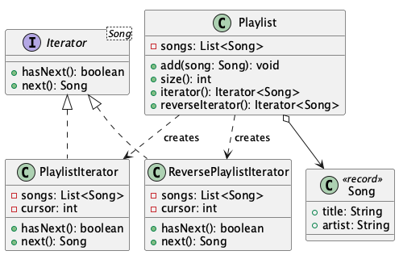

# Playlist Traversal

**Pattern:** [Iterator](../README.md)

## 📖 The Story (the problem)
A music app has a `Playlist`. The UI, the shuffle engine, and the "now playing" widget all need to
walk through its songs.

The tempting shortcut is to expose the internal list — `playlist.getSongs()` — and let everyone loop
over it. That backfires:

* Every caller becomes **coupled to the storage choice**. Switch from an `ArrayList` to a database
  cursor or a linked structure later and all that looping code breaks.
* Encapsulation leaks: anyone can reach in and **mutate the list** while another part is reading it.
* "Walk it backwards" or "walk only the favourites" turns into duplicated loop logic scattered
  across the codebase.

## 💡 The Solution (using the Iterator pattern)
Let the collection hand out an **iterator** — a small object that knows how to step through the
songs one at a time. Callers ask "is there a next song?" and "give me the next song" without ever
seeing how the songs are stored.

* **`Playlist`** — the *aggregate*. It holds the songs and creates iterators over itself. It
  implements `Iterable`, so it also works with Java's for-each loop.
* **`PlaylistIterator`** — the *iterator*: walks first → last, exposing only `hasNext()`/`next()`.
* **`ReversePlaylistIterator`** — a second, independent iterator that walks last → first. Multiple
  traversals over the same data, with the storage still hidden, is the pattern's superpower.

## 💻 In Code
```java
Playlist playlist = new Playlist();
playlist.add(new Song("Bohemian Rhapsody", "Queen"));
playlist.add(new Song("Hotel California", "Eagles"));

for (Song song : playlist) {          // uses PlaylistIterator under the hood
    System.out.println(song);
}

Iterator<Song> reverse = playlist.reverseIterator();
while (reverse.hasNext()) {
    System.out.println(reverse.next());
}
```

## 🛠️ UML Diagram



## 🎯 What We Gain
* **Hidden internals:** callers traverse without knowing (or depending on) how songs are stored.
* **Multiple, independent walks:** forward, reverse, or filtered — each iterator carries its own
  position, so two can run at once.
* **Uniform traversal:** the same `hasNext()/next()` protocol works regardless of the structure.
* **Idiomatic Java:** implementing `Iterable` plugs straight into the for-each loop.

## ⚠️ Watch Out For
* **Modifying while iterating:** changing the playlist mid-walk can corrupt an iterator's position;
  Java's own collections throw `ConcurrentModificationException` for exactly this reason.
* **Overkill for plain lists:** if a standard `List` already does the job, you don't need a custom
  iterator — reach for this when the collection is custom or its internals must stay hidden.
* **One-shot objects:** an iterator is consumed as you go; to traverse again, ask the aggregate for
  a fresh one.
