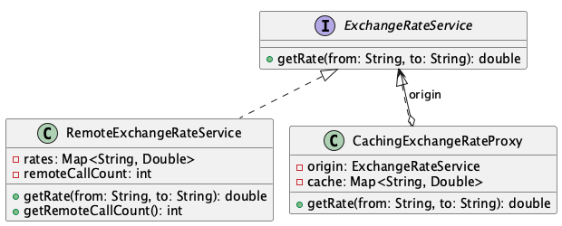

# Caching Exchange Rate

**Pattern:** [Proxy](../README.md)

## 📖 The Story (the problem)
Our checkout needs currency conversion, so it calls a third-party exchange-rate API. That call is
**expensive**: it's a network round-trip that takes real time and may be rate-limited or billed per
request.

During a single page render we might ask for `USD->EUR` several times. Hitting the remote API again
and again for the *same* answer is wasteful:

* Every lookup pays the full network latency.
* We burn through our request quota (and bill) on duplicate questions.
* If we scatter "remember the last answer" logic through the calling code, caching gets duplicated
  and inconsistent.

## 💡 The Solution (using the Proxy pattern)
Put a **proxy** in front of the real service that implements the *same interface*. Callers can't
tell the difference, but the proxy quietly caches results and only forwards a request to the real
service when it hasn't seen that question before.

* **`ExchangeRateService`** — the *subject* interface both implementations share.
* **`RemoteExchangeRateService`** — the *real subject*: the expensive service (here it simulates
  latency and counts how often it's actually called).
* **`CachingExchangeRateProxy`** — the *proxy*. It holds a reference to the real service, keeps a
  cache of rates it has already fetched, and serves repeats without a remote call.

## 💻 In Code
```java
RemoteExchangeRateService remote = new RemoteExchangeRateService();

// Hand the client a proxy instead of the real service — same interface.
ExchangeRateService rates = new CachingExchangeRateProxy(remote);

rates.getRate("USD", "EUR");   // miss -> calls the remote service
rates.getRate("USD", "EUR");   // hit  -> served from cache, no remote call
rates.getRate("USD", "EUR");   // hit  -> served from cache

System.out.println(remote.getRemoteCallCount()); // 1
```

## 🛠️ UML Diagram



## 🎯 What We Gain
* **Fewer expensive calls:** duplicate lookups are answered instantly from the cache.
* **Transparency:** because the proxy shares the interface, no calling code has to change.
* **Separation of concerns:** caching lives in the proxy, not smeared across the business logic.
* **Easy to swap:** drop the proxy in or out without touching the real service or its clients.

## ⚠️ Watch Out For
* **Stale data:** exchange rates change. A real cache needs an expiry/TTL so it doesn't serve
  yesterday's price forever.
* **Memory growth:** an unbounded cache keeps growing; consider an eviction policy (e.g. LRU).
* **Thread safety:** a plain `HashMap` cache isn't safe under concurrent access — use a concurrent
  map or synchronisation if multiple threads share the proxy.
