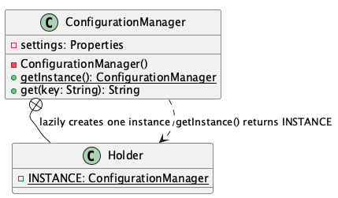

# Configuration Manager

**Pattern:** [Singleton](../README.md)

## 📖 The Story (the problem)
Almost every app has settings it needs everywhere: the app name, the database URL, the current
environment, and so on. These usually live in a file that is read once when the app starts.

Imagine every class that needs a setting reads and parses that file on its own:

* The file gets opened and parsed **over and over**, which is slow and wasteful.
* Different parts of the app might end up with **slightly different copies** of the settings.
* There is **no single place** that owns "the configuration" — it is scattered everywhere.
* In a multithreaded app, two threads loading the file at the same time can step on each other.

## 💡 The Solution (using the Singleton pattern)
The Singleton pattern guarantees there is **exactly one** `ConfigurationManager` for the whole app,
created once and shared by everyone.

* **`ConfigurationManager`** — the Singleton. Its constructor is **private**, so no one can call
  `new ConfigurationManager()`. It loads `application.properties` a single time and keeps the values.
* **`getInstance()`** — the one global access point. Every caller gets back the same object.
* **`Holder`** — a private static nested class that holds the instance. This is the
  *initialization-on-demand holder idiom*: the JVM creates the instance lazily and thread-safely the
  first time `getInstance()` is called, with no manual locking needed.

## 💻 In Code
```java
// No matter where or how often you ask, you get the same object back.
ConfigurationManager first = ConfigurationManager.getInstance();
ConfigurationManager second = ConfigurationManager.getInstance();

System.out.println(first == second);          // true — one shared instance
System.out.println(first.get("app.name"));    // "Design Patterns Palette"
```

## 🛠️ UML Diagram



## 🎯 What We Gain
* **One source of truth:** every part of the app reads the same settings.
* **Loaded once:** the file is parsed a single time, not on every lookup.
* **Thread-safe by design:** the holder idiom builds the instance exactly once, even under concurrency.
* **Simple access:** `getInstance()` is available from anywhere, no wiring required.

## ⚠️ Watch Out For
* **Global state:** because anyone can reach it, a Singleton can hide dependencies and make code
  harder to test. Prefer passing it in (dependency injection) where you can.
* **Don't overuse it:** not everything needs to be a Singleton — reach for it only when a single
  shared instance is genuinely required.
* **Mutable shared data:** if you let callers change the settings at runtime, you must make those
  changes thread-safe too.
