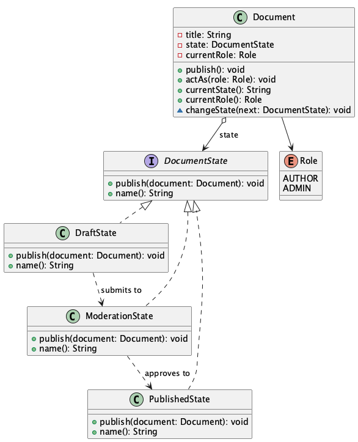

# Document Publishing Workflow

**Pattern:** [State](../README.md)

## 📖 The Story (the problem)
A document in a CMS moves through stages: **Draft → Moderation → Published**. What "publish" does
depends entirely on where the document currently is — and sometimes on *who* is clicking the button.

The naive version keeps a `status` field and branches on it:

```java
if (status.equals("DRAFT")) { ... }
else if (status.equals("MODERATION")) { if (role == ADMIN) ... else ... }
else if (status.equals("PUBLISHED")) { ... }
```

That `if/else` (or `switch`) reappears in every method — publish, edit, archive — and:

* The transition rules are **smeared across the class** and easy to get inconsistent.
* Adding a stage (e.g. "Scheduled") means editing **every** one of those branches.
* It's hard to see the actual state machine; it's hidden inside conditionals.

## 💡 The Solution (using the State pattern)
Give each stage its own class and let the document **delegate** to its current state. The state
object decides what happens and which state comes next, so the document's behaviour changes simply
by swapping its state.

* **`Document`** — the *context*. It holds the current `DocumentState` and forwards `publish()` to
  it; it never branches on a status field.
* **`DocumentState`** — the *state* interface (`publish(document)`).
* **`DraftState` / `ModerationState` / `PublishedState`** — the concrete states. Each implements
  `publish()` its own way and triggers the next transition. `ModerationState` even varies by role:
  an admin approves and it goes live, an author cannot.

## 💻 In Code
```java
Document doc = new Document("State Pattern Explained", Role.AUTHOR);
doc.currentState();   // "Draft"

doc.publish();        // Draft -> Moderation
doc.publish();        // author can't approve -> still "Moderation"

doc.actAs(Role.ADMIN);
doc.publish();        // admin approves -> "Published"
```

## 🛠️ UML Diagram



## 🎯 What We Gain
* **No status `switch`:** behaviour lives in the state classes, not in sprawling conditionals.
* **Each transition in one place:** a state knows exactly what it does and where it goes next.
* **Open/Closed:** add a new stage by adding a class; existing states are untouched.
* **Self-documenting:** the set of state classes *is* the state machine.

## ⚠️ Watch Out For
* **Where do transitions live?** Here each state picks its successor. That's clean but couples
  states to one another — for complex graphs, consider centralising transitions in the context.
* **State explosion:** lots of states with subtle differences can multiply classes; group shared
  behaviour in an abstract base if it helps.
* **It's not Strategy.** State and Strategy look identical in UML, but State models *transitions
  over time* (the object changes its own state), while Strategy just swaps an interchangeable
  algorithm chosen from outside.
