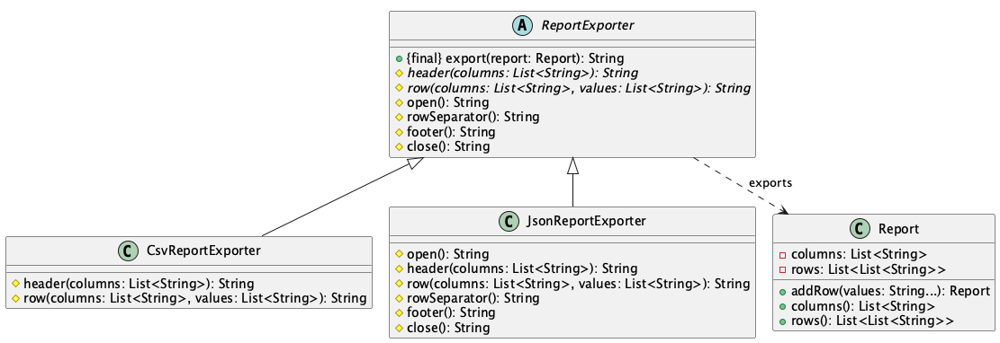

# Report Exporter

**Pattern:** [Template Method](../README.md)

## 📖 The Story (the problem)
Your app exports the same tabular report in several formats — CSV today, JSON tomorrow, maybe HTML
next. Every format follows the **same shape**: open the document, write a header, write each row,
write a footer, close. Only the details of each step differ.

If you write a separate exporter per format from scratch, that shared shape gets **copy-pasted**:

* The "loop over the rows" logic is duplicated in every exporter, and they drift apart over time.
* A change to the overall flow (say, add a summary footer) must be made in *every* class.
* Nothing enforces that all formats actually follow the same steps in the same order.

## 💡 The Solution (using the Template Method pattern)
Put the fixed algorithm in one place — a `final` **template method** on a base class — and let
subclasses override only the individual steps.

* **`ReportExporter`** — the abstract base. Its `export()` is the *template method*: it defines the
  unchanging order (open → header → rows → footer → close) and is `final` so subclasses can't reorder
  it. `header()` and `row()` are abstract *required steps*; `open()`, `rowSeparator()`, `footer()`,
  and `close()` are *hooks* with empty defaults a format overrides only if it needs to.
* **`CsvReportExporter`** — fills in just the header and row steps; every hook stays empty.
* **`JsonReportExporter`** — reuses the same skeleton but overrides the hooks to wrap the rows in
  `[ ... ]`, comma-separate them, and render each row as a JSON object.

## 💻 In Code
```java
Report report = new Report("region", "units")
        .addRow("West", "120")
        .addRow("East", "95");

System.out.print(new CsvReportExporter().export(report));
// region,units
// West,120
// East,95

System.out.print(new JsonReportExporter().export(report));
// [
//   {"region": "West", "units": "120"},
//   {"region": "East", "units": "95"}
// ]
```

## 🛠️ UML Diagram



## 🎯 What We Gain
* **No duplicated flow:** the export sequence lives in one method, not copied into every format.
* **Consistency by construction:** because `export()` is `final`, every format runs the same steps
  in the same order.
* **Easy to extend:** a new format is a small subclass that fills in a couple of steps.
* **Hooks for the optional bits:** formats override only the steps they care about and ignore the rest.

## ⚠️ Watch Out For
* **Inheritance, not composition:** the pattern is built on subclassing, which is rigid. When you
  need to mix and match behaviours at runtime, [Strategy](../../strategy/README.md) is often a better
  fit.
* **Too many hooks:** a skeleton riddled with optional steps becomes hard to follow — keep the set of
  overridable steps small and meaningful.
* **The Hollywood Principle:** the base class calls the subclass steps ("don't call us, we'll call
  you"), so a subclass must respect the contract of each step it overrides.
